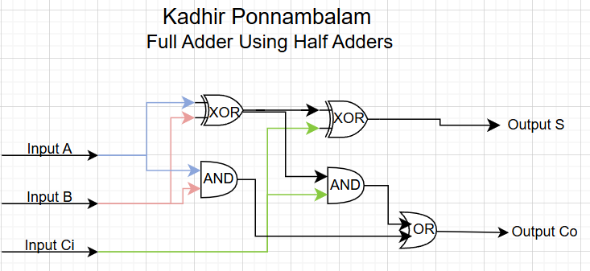
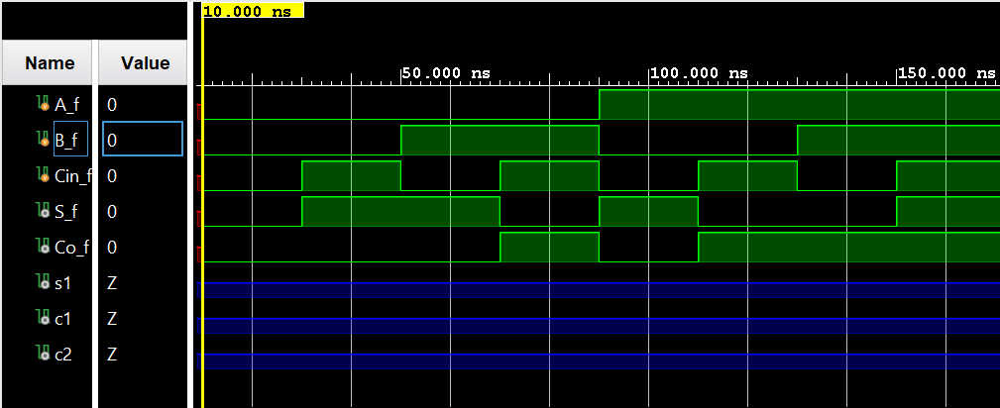

## Full Adder Using Two Half Adders

A Verilog implementation of a **full adder built from two half adders**, developed using the Vivado IDE. This document explains the underlying theory, shows how the full adder is constructed hierarchically from half adders, and summarizes the truth tables, K‑maps, and simulation results.

---

## Table of Contents

- [What Is a Full Adder Using Half Adders?](#what-is-a-full-adder-using-half-adders)
- [Half Adder Refresher](#half-adder-refresher)
- [Learning Resources](#learning-resources)
- [Truth Tables](#truth-tables)
  - [Half Adder Truth Table](#half-adder-truth-table)
  - [Full Adder Truth Table](#full-adder-truth-table)
- [K-Maps and Boolean Derivations](#k-maps-and-boolean-derivations)
  - [Half Adder K-Maps](#half-adder-k-maps)
  - [Full Adder K-Maps](#full-adder-k-maps)
- [Full Adder Construction from Two Half Adders](#full-adder-construction-from-two-half-adders)
- [Circuit Diagram](#circuit-diagram)
- [Waveform Diagram](#waveform-diagram)
- [Testbench Output](#testbench-output)
- [Running the Project in Vivado](#running-the-project-in-vivado)
- [Project Files](#project-files)

---

## What Is a Full Adder Using Half Adders?

A **full adder** is a combinational circuit that adds three single-bit binary inputs and produces a **sum** \(S\) and a **carry-out** \(C_o\). The inputs are:

- **A**, **B** – the two bits to be added.
- **C\_i** – the carry-in from the previous stage.

The outputs are:

- **S** – the least significant bit of \(A + B + C_i\).
- **C\_o** – the carry-out, which is 1 when at least two of \(A\), \(B\), and \(C_i\) are 1.

In this project, the full adder is **implemented structurally** using **two half adder modules and one OR gate**, rather than a single flat behavioral description. This style closely mirrors how adders are drawn in textbook block diagrams and highlights hierarchical digital design.

The standard full adder equations are:

\[
$$S = A \oplus B \oplus C_i$$
\]
\[
$$C_o = AB + AC_i + BC_i$$
\]

The design here realizes these same equations by combining the equations of two half adders.

---

## Half Adder Refresher

A **half adder** is the basic building block used to construct the full adder. It has two inputs and two outputs:

- **Inputs:** \(A\), \(B\)
- **Outputs:** **S** (sum), **C** (carry)

The Boolean equations for a half adder are:

\[
$$S = A \oplus B$$
\]
\[
$$C = A \cdot B$$
\]

These equations will be reused to derive the full adder implementation using two half adders.

---

## Learning Resources

Useful online resources for full adders, half adders, and digital design:

| Resource | Description |
|----------|-------------|
| [Full Adder (YouTube)](https://www.youtube.com/results?search_query=full+adder) | Concept, truth table, and typical gate-level implementations. |
| [Half Adder (YouTube)](https://www.youtube.com/results?search_query=half+adder) | How the half adder works and why its equations are \(S = A \oplus B\), \(C = A \cdot B\). |
| [Full Adder Using Half Adders (YouTube)](https://www.youtube.com/results?search_query=full+adder+using+half+adder) | Block-level explanation of building a full adder from two half adders. |
| [Full Adder Verilog (YouTube)](https://www.youtube.com/results?search_query=full+adder+verilog) | RTL and testbench examples in Verilog. |
| [K-Map Simplification (YouTube)](https://www.youtube.com/results?search_query=karnaugh+map+simplification) | Karnaugh-map based derivation of minimal sum and carry expressions. |

---

## Truth Tables

### Half Adder Truth Table

The half adder has two inputs \(A\), \(B\) and two outputs \(S\), \(C\).

| **A** | **B** | **‖** | **S** | **C** |
|:-----:|:-----:|:-----:|:-----:|:-----:|
| **———** | **———** | **———** | **———** | **———** |
| 0 | 0 | **\|** | 0 | 0 |
| 0 | 1 | **\|** | 1 | 0 |
| 1 | 0 | **\|** | 1 | 0 |
| 1 | 1 | **\|** | 0 | 1 |

This behavior directly corresponds to:

\[
$$S = A \oplus B,\quad C = A \cdot B$$
\]

### Full Adder Truth Table

The full adder has three inputs \(A\), \(B\), \(C_i\) and two outputs \(S\), \(C_o\). The truth table is:

| **A** | **B** | **C\_i** | **‖** | **S** | **C\_o** |
|:-----:|:-----:|:--------:|:-----:|:-----:|:--------:|
| **———** | **———** | **———** | **———** | **———** | **———** |
| 0 | 0 | 0 | **\|** | 0 | 0 |
| 0 | 0 | 1 | **\|** | 1 | 0 |
| 0 | 1 | 0 | **\|** | 1 | 0 |
| 0 | 1 | 1 | **\|** | 0 | 1 |
| 1 | 0 | 0 | **\|** | 1 | 0 |
| 1 | 0 | 1 | **\|** | 0 | 1 |
| 1 | 1 | 0 | **\|** | 0 | 1 |
| 1 | 1 | 1 | **\|** | 1 | 1 |

This is the **final truth table** of the full adder, and it remains unchanged whether the full adder is realized directly or constructed from half adders.

---

## K-Maps and Boolean Derivations

### Half Adder K-Maps

For the half adder, treat \(A\) as the row variable and \(B\) as the column variable.

**Sum \(S\):**

| **A \\ B** | **0** | **1** |
|:----------:|:-----:|:-----:|
| **0** | 0 | 1 |
| **1** | 1 | 0 |

**Grouping:** two single 1s (no larger groups possible), giving:

\[
$$S = \overline{B}A + B\overline{A} = A \oplus B$$
\]

**Carry \(C\):**

| **A \\ B** | **0** | **1** |
|:----------:|:-----:|:-----:|
| **0** | 0 | 0 |
| **1** | 0 | 1 |

**Grouping:** one single 1, giving:

\[
$$C = A \cdot B$$
\]

These are exactly the standard half adder equations.

### Full Adder K-Maps

For the full adder, use \(A\) as the row variable and \(BC_i\) as the column variables (Gray code order 00, 01, 11, 10).

**Sum \(S\):**

| **A \\ B C\_i** | **00** | **01** | **11** | **10** |
|:---------------:|:------:|:------:|:------:|:------:|
| **0** | 0 | 1 | 0 | 1 |
| **1** | 1 | 0 | 1 | 0 |

Observation: \(S\) is 1 when an **odd number** of \(A\), \(B\), \(C_i\) are 1. The minimal expression is:

\[
$$S = A \oplus B \oplus C_i$$
\]

**Carry-out \(C_o\):**

| **A \\ B C\_i** | **00** | **01** | **11** | **10** |
|:---------------:|:------:|:------:|:------:|:------:|
| **0** | 0 | 0 | 1 | 0 |
| **1** | 0 | 1 | 1 | 1 |

Grouping the 1s in pairs gives:

\[
$$C_o = AC_i + BC_i + AB$$
\]

An equivalent, factorized form that is especially useful for the half-adder construction is:

\[
$$C_o = AB + C_i(A \oplus B)$$
\]

---

## Full Adder Construction from Two Half Adders

To implement a full adder using two half adders:

1. **First half adder**
   - Inputs: \(A\), \(B\)
   - Outputs: intermediate sum \(S_1\), intermediate carry \(C_1\)
   - Equations:
     \[
     $$S_1 = A \oplus B,\quad C_1 = A \cdot B$$
     \]

2. **Second half adder**
   - Inputs: \(S_1\), \(C_i\)
   - Outputs: final sum \(S\), intermediate carry \(C_2\)
   - Equations:
     \[
     $$S = S_1 \oplus C_i = A \oplus B \oplus C_i$$
     \]
     \[
     $$C_2 = S_1 \cdot C_i = C_i(A \oplus B)$$
     \]

3. **Final carry OR gate**
   - Inputs: \(C_1\), \(C_2\)
   - Output: full-adder carry-out \(C_o\)
   - Equation:
     \[
     $$C_o = C_1 + C_2 = AB + C_i(A \oplus B)$$
     \]

Thus, the hierarchical construction using two half adders and one OR gate exactly implements the standard full adder equations:

\[
$$S = A \oplus B \oplus C_i$$
\]
\[
$$C_o = AB + AC_i + BC_i = AB + C_i(A \oplus B)$$
\]

In Verilog, this is realized by instantiating the `halfAdder` module twice inside `fullAdder`, then combining the two carry outputs with an OR operation.

---

## Circuit Diagram



The conceptual diagram is:

- First half adder takes \(A\) and \(B\) → outputs \(S_1\) and \(C_1\).
- Second half adder takes \(S_1\) and \(C_i\) → outputs final sum \(S\) and intermediate carry \(C_2\).
- An OR gate combines \(C_1\) and \(C_2\) to produce \(C_o\).

This matches the block-diagram style typically shown in textbooks for a **full adder built from two half adders**.

---

## Waveform Diagram

The behavioral simulation waveform for the full adder using half adders shows inputs \(A\), \(B\), and \(C_i\) cycling through all eight combinations, while outputs \(S\) and \(C_o\) follow the full-adder truth table.



Key checks:

- For each input combination, verify that \(S\) and \(C_o\) match the [full adder truth table](#full-adder-truth-table).
- Confirm that the hierarchical half-adder-based implementation behaves identically to a direct full-adder implementation.

---

## Testbench Output

The testbench applies all eight combinations of \((A, B, C_i)\) and prints the corresponding outputs:

```text
A=0, B=0, Ci=0, S=0, Co=0 

A=0, B=0, Ci=1, S=1, Co=0 

A=0, B=1, Ci=0, S=1, Co=0 

A=0, B=1, Ci=1, S=0, Co=1 

A=1, B=0, Ci=0, S=1, Co=0 

A=1, B=0, Ci=1, S=0, Co=1 

A=1, B=1, Ci=0, S=0, Co=1 

A=1, B=1, Ci=1, S=1, Co=1 
```

These results match the theoretical full adder truth table, confirming that the **full adder constructed from two half adders** is functionally correct.

---

## Running the Project in Vivado

Follow these steps to open the project in **Vivado** and run the simulation.

### Prerequisites

- **Xilinx Vivado** installed (Vivado HL Design Edition, Lab Edition, or any recent version compatible with your OS).

### 1. Launch Vivado

1. Start Vivado from the Start Menu (Windows) or your application launcher.
2. Choose **Vivado** (or **Vivado HLx**).

### 2. Create a New RTL Project

1. Click **Create Project** (or **File → Project → New**).
2. Click **Next** on the welcome page.
3. Choose **RTL Project** and leave **Do not specify sources at this time** unchecked if you plan to add sources immediately.
4. Click **Next**.

### 3. Add Design and Simulation Sources

1. In the **Add Sources** step, add the Verilog design files:
   - **Design sources:**
     - `halfAdder.v` – half adder module.
     - `fullAdder.v` – full adder module that instantiates two half adders.
   - **Simulation sources:**
     - `fullAdder_tb.v` – testbench applying all input combinations.
2. Ensure the testbench is set as the **top module for simulation**:
   - In the **Sources** window, under **Simulation Sources**, right‑click `fullAdder_tb.v` → **Set as Top**.
3. Click **Next**, choose a suitable **target device** (or leave default/“Don’t specify” for simulation-only usage), then **Next → Finish**.

### 4. Run Behavioral Simulation

1. In the **Flow Navigator** (left panel), under **Simulation**, click **Run Behavioral Simulation**.
2. Vivado will:
   - Elaborate the design hierarchy (`fullAdder` instantiating `halfAdder`).
   - Compile the design and testbench.
   - Open the **Simulation** view with the waveform.
3. Inspect the waveform:
   - Confirm that \(A\), \(B\), and \(C_i\) cycle through all eight combinations.
   - Verify that \(S\) and \(C_o\) match the [full adder truth table](#full-adder-truth-table).

### 5. (Optional) Re-run or Modify the Design

- To re-run the simulation, use **Flow Navigator → Simulation → Run Behavioral Simulation** or the re-run icon in the simulation toolbar.
- To change the design or testbench:
  - Edit `halfAdder.v`, `fullAdder.v`, or `fullAdder_tb.v`.
  - Save the files.
  - Re-run the behavioral simulation.

### 6. (Optional) Synthesis, Implementation, and Bitstream

If you want to map the design to a physical FPGA:

1. In **Sources**, right‑click the top-level RTL module (`fullAdder.v`) → **Set as Top** (for synthesis/implementation).
2. Run **Synthesis** from the Flow Navigator.
3. Run **Implementation**.
4. Create or edit a constraints file (e.g. `.xdc`) to assign pins for \(A\), \(B\), \(C_i\), \(S\), and \(C_o\).
5. Run **Generate Bitstream** to produce the configuration file for your FPGA board.

---

## Project Files

- `halfAdder.v` — RTL for the half adder \((A, B) \rightarrow (S, C)\).
- `fullAdder.v` — RTL for the full adder constructed from two half adders and an OR gate \((A, B, C_i) \rightarrow (S, C_o)\).
- `fullAdder_tb.v` — Testbench for the full adder; applies all input combinations and prints/observes the outputs.

*Author: **Kadhir Ponnambalam***

